# Rogue Linux ▐ COGMAN ▌

A minimal, deterministic, and AI-assisted Linux distribution build system.

## 🛡️ Executive Summary
Rogue Linux is a metadata-driven infrastructure for constructing sovereign operating systems. It utilizes a strict, two-stage **modular architecture** that separates planning (Rust) from execution (C), ensuring absolute predictability and near-zero build overhead.

## ✨ Key Features
- **Deterministic Pipeline**: Identical inputs yield bit-identical build plans.
- **Modular Cogman**:
    - **Planner (Rust)**: High-safety dependency resolution and validation.
    - **Executor (C)**: High-performance, isolated instruction runner.
    - **Advisor (AI)**: Local LLM (`Qwen2.5-3B`) for context-aware failure analysis, gated by build flags.
- **Rogue Labs**: Integrated hybrid cloud/local testing environment with OpenVPN support.
- **Cyberpunk SSG**: High-performance website engine (76KB payload) for package indexing and community.
- **Production-Ready Metadata**: 166 packages verified with strict `package.toml` schema (v1.0).

## 📊 Performance Benchmarks
The modular refactor (Rust/C) achieved massive reductions in overhead compared to the legacy Python implementation.

```mermaid
gantt
    title Build System Overhead (ms)
    dateFormat  X
    axisFormat %s
    section Legacy (Python)
    Load & Resolve : 0, 450
    section Current (Rust)
    Load & Resolve : 0, 8
```



| Metric | Legacy (Python) | Current (Modular) | Improvement |
|--------|-----------------|-------------------|-------------|
| **Planner Latency** | ~450ms | **~8ms** | **56x Faster** |
| **Peak Memory (RSS)** | ~85MB | **~4MB** | **21x Reduction** |
| **Exec Overhead** | ~45ms/proc | **~0.9ms/proc** | **50x Faster** |

## 🏗️ Architecture
```mermaid
graph LR
    TOML[package.toml] --> Planner[Rust Planner]
    Planner -->|Binary Plan| Exec[C Executor]
    Exec -->|Isolated Build| RootFS[/mnt/rogue]
    
    subgraph "AI Gating"
    Planner -.->|Failure Context| Advisor[AI Advisor]
    Advisor -.->|Butler Advice| User[Operator]
    end
```

## 🗺️ Documentation Map
- **[ARCHITECTURE](./docs/architecture/ARCHITECTURE.md)**: Deep dive into the two-stage logic.
- **[AI STRATEGY](./docs/architecture/ai_architecture.md)**: Model selection and safety boundaries.
- **[METADATA](./docs/implementation/METADATA.md)**: Defining packages for Rogue Linux.
- **[HISTORY](./docs/project/HISTORY.md)**: The journey from LFS to Cyberpunk.
- **[VERIFICATION](./docs/VERIFICATION_AUDIT.md)**: Final audit results.

## 🚀 Status
The **Infrastructure Hardening** phase is complete. The build system, website, and AI advisor are fully verified. The project is currently positioned for the final **Rootfs Construction** phase.

---
*"Boring systems are good systems. Precision is our primary aesthetic."*
