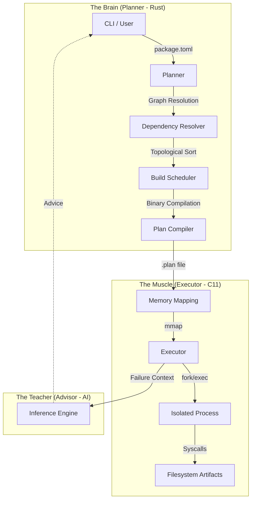

# Cogman: The Tactical Build Subsystem of Rogue Linux

Cogman is a high-performance, AI-augmented build and management system designed for **Rogue Linux**—a specialized pentesting distribution. It prioritizes speed, security, and tactical intelligence over the bloat of traditional package managers.

## 🛡️ Why Cogman for Pentesting?

In a high-stakes pentesting environment, your OS must be an extension of your intent. Cogman was forged with three core pillars:

1.  **Velocity**: In the field, tool deployment must be instant. Cogman's **BTM** (Binary Tool Metadata) and **mmap-based execution** provide O(1) metadata access, making it several orders of magnitude faster than standard package managers.
2.  **Hardened Reliability**: Built with **Rust** (Planner) for safety and **C11** (Executor) for minimalist efficiency. The build engine has a near-zero dependency footprint, reducing the attack surface and ensuring stability during critical operations.
3.  **Tactical Assistance**: Pentesting tools often have complex, fragile build systems. The **Cogman Advisor** (Local AI) provides real-time diagnostics and solutions, allowing operators to fix environment issues without leaving the terminal.

---

## 🏛️ System Architecture

Cogman is separated into two phases to ensure a "Think Once, Execute Millions" flow.

---

## 📂 Modular Documentation

For developers and contributors, our documentation is split by component:

- **[Planner](planner/README.md)**: Detailed internals of metadata parsing, graph theory, and plan serialization.
- **[Executor](executor/README.md)**: Deep dive into the C11 runtime, mmap mechanics, and process isolation.
- **[Advisor](advisor/README.md)**: The neural engine architecture, training pipelines, and safety sandboxes.
- **[Messenger](messenger/README.md)**: The RMAN protocol and tactical HUD implementation.

---

## 🚀 Performance Benchmarks

| Metric | Cogman (BTM) | Traditional (SQLite/TOML) | Improvement |
| :--- | :--- | :--- | :--- |
| **Metadata Lookup** | **< 1μs** | ~1.5ms - 50ms | **10,000x - 50,000x** |
| **Plan Dispatch** | **Instant (mmap)** | Recursive Parsing | **Infinite (Zero parse)** |
| **Memory Usage** | **Shared (Kernal-level)** | Heap Allocation | **Minimal (Static)** |

> **"If you can't build it in the time it takes to brew coffee, the system is failed. Cogman builds in the time it takes to blink."**
