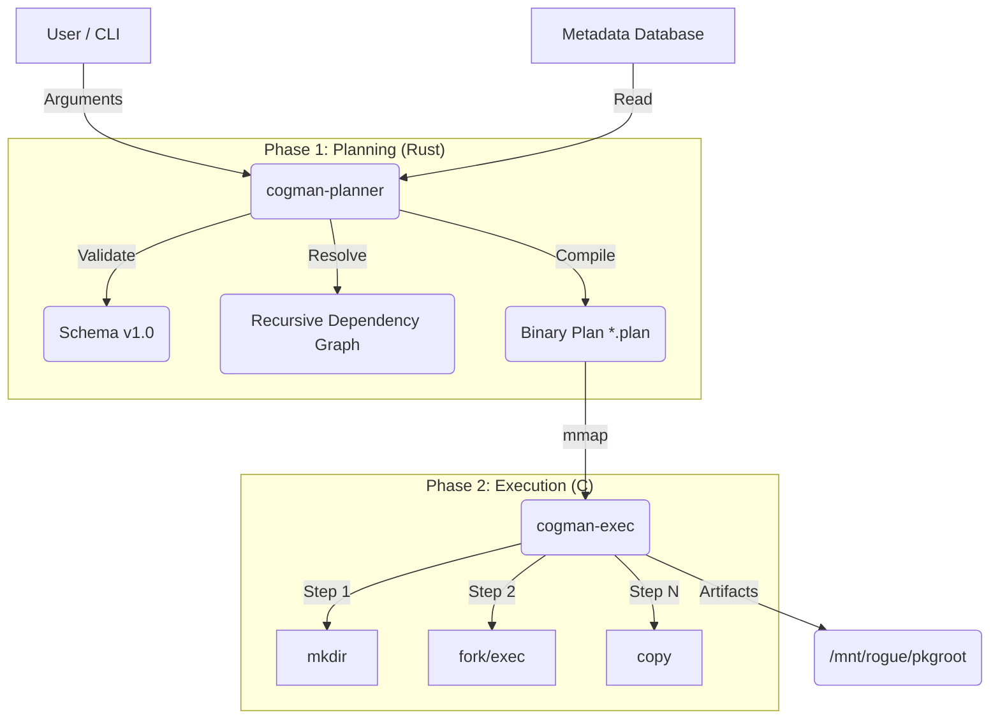

# System Architecture

The Cogman Build System is composed of two distinct binaries that communicate via a binary plan format.

## 1. The Planner (`cogman-planner`)
Written in **Rust**.
-   **Responsibility**: Validation, Business Logic, Safety Checks.
-   **Input**: `package.toml` + CLI flags.
-   **Output**: An execution plan (`out.plan`) or error.
-   **Key Modules**:
    -   `metadata`: Serde-based TOML parsing.
    -   `graph`: `petgraph`-based dependency resolution.
    -   `plan`: Binary serialization (see `DATA-FLOW.md`).

## 2. The Link (`.plan` file)
A custom binary format designed for zero-parsing execution.
-   **Header**: Magic bytes, version, step count.
-   **Steps**: Fixed-size `struct Step { op, cmd, env, ... }`.
-   **String Table**: Null-terminated strings for arguments.

## 3. The Executor (`cogman-exec`)
Written in **C11**.
-   **Responsibility**: Performance, Isolation, Obedience.
-   **Input**: `out.plan`.
-   **Output**: Return code 0 (Success) or 1 (Failure).
-   **Constraints**:
    -   No heap allocation for steps (mmap).
    -   No logic branching based on package name.
    -   Strict error handling (fail-fast).

## Directory Structure
-   `/platform`: Source code.
-   `/metadata`: Package definitions.
-   `/docs`: This documentation.
